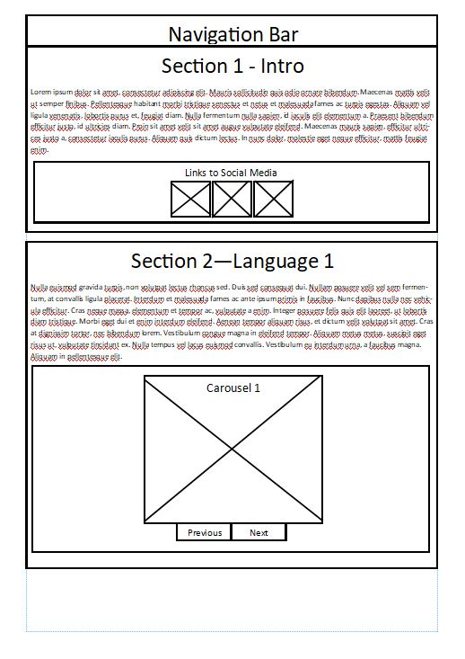
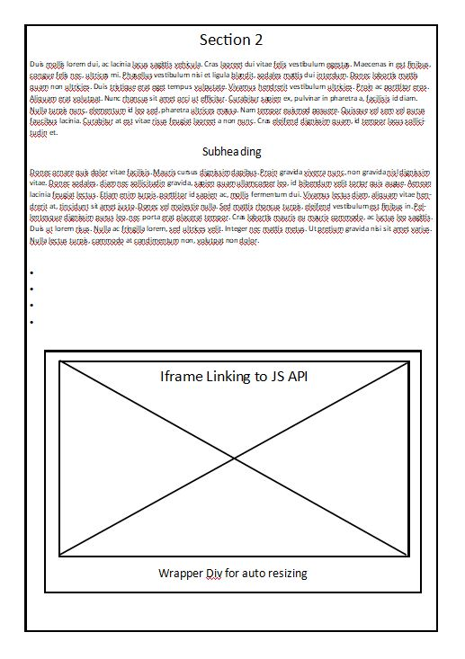
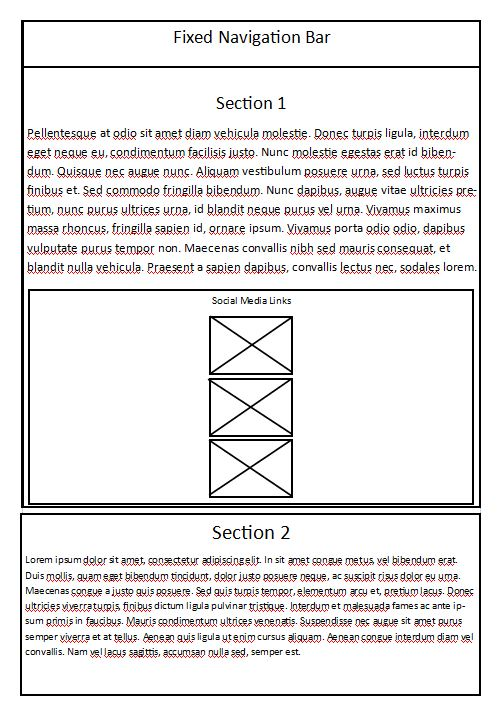

# Documentation for https://achu-dev.github.io/A-Chu-Dev.github.io/

## Background
I am hoping to solve the problem of my lack of an access to a record of all of the projects I have completed. This is a problem as it limits the amount of self-promotion I can do, because I would have to manually send each project per person.

I would like to create a website which is mobile first mainly due to the decline in Desktop viewing of websites, also using a Dark Colour Theme would be nice as I find it better for mobile devices which use OLED displays and can show 'true black' and blacks better than LED displays.

## Wire Frames
The mobile first aspect of my Website is that it follows an all-on-one page style which emphasises scrolling, when running in desktop mode the navigation bar does not stay fixed with the content whereas on mobile it becomes fixed.  This is also true for the Social Media Links where they change orientation based on the device your using as larger icons is better for touch screens.
### Desktop Wire Frames

### Mobile Wire Frames

## Colour Choices
I am using 2 colours for this project with 2 additional shades each in the format of primary/secondary colour with light and dark. These also have a text colour of white and black respectively. To get these colours I used this colour picker:

[Colour Picker Inline Link](https://material.io/resources/color/#!/?view.left=0&view.right=0&primary.color=424242&secondary.color=4DB6AC)

The colours I am using is:

1. Primary Colour: #424242  
* Primary Light: #6d6d6d
* Primary Dark: #1b1b1b
* Primary Text: #FFFFFF
2. Secondary Colour: #4db6ac
* Secondary Light: #82e9de
* Secondary Dark: #00867d
* Secondary Text: #000000

These were chosen due to my desire for a dark themed website which uses its dark grey colours to show depth, which is how dark themed websites create depth compared to the colourful and accented light theme website. Most Dark Themes use the darkest colours as a background with lighter colours on top of it to show the Ribbons, this applied without using 'True Black' is important as LCD displays cannot display 'True Black'. Some Phones and mobile devices can Show 'True Black' with its OLED panel which allows the dark theme to actually conserve them battery life as well as reducing eye strain on the viewer.

## W3C Validation
I am using the W3C validation tool for VSCode which 'Lints' (cross-references) the code to test the program against the latest implemented W3C rules. This does not apply to libraries that it does not read this important as some API's may not be valid in nature but the Linter does not show an error, when checking for W3C rules I made sure that the code followed the respective rules like: 'Every img tag must have a respective alt' (W3C, 2019, https://www.w3.org/standards/webdesign/accessibility).

## GDPR
In accordance with the General Data Protection Regulation there will be a created privacy policy which will explain exactly what is being recorded by the website and why it has been recorded. This is important as it legally binding for any website which takes any information to the user. Also I have made any forms on the website use opt-in meaning that the user has given confirmation that the data has not been in anyway taken without consent.

On the Privacy Policy I have recorded:
1. Information Being Recorded
2. How long kept data is stored
3. The usage of taken data
4. The usage of Cookies
5. Any Linked Websites

## Copyright and Creative Commons
For any project where I have used external files like sound clips or sprites, I have added in the attribution to the original producer this includes using brand logos like Twitter or LinkedIn® who according to their brand guidelines have restrictions on colour and size. For example, Twitter state that their logo has to be Blue or White depending on the background, also each Logo is from their websites under a non-profit creative commons license.

## Online and Distance Selling Act
As this website is not an e-commerce or a software selling site and is purely for a non-profit purpose of self-promotion it conforms to this act.

## Evaluation
I have moderately achieved the problem that I have of self-promotion as it fills in the easy access to a Portfolio of my work but seeing as the subject matter is fairly basic it needs constant update and refinement. The few issues it has are the lack of any Server Side Programming (SSP) inside of the web application itself, and the lack for Asynchronous JavaScript And XML (AJAX) as for example the User Comments form could benefit from AJAX and SSP where it does not load a new page using PHP as a response for a POST request. And records the response inside of a Web Hosted Database this is important as most consumer grade products use SSP and the lack of an example detracts from the portfolio.

When Testing the website, I used the GitPages subset of GitHub to host the website Live on the internet so that it could be Tested on:
1. A Mobile Phone in this case a Samsung Galaxy A51
2. A Desktop PC inside of the Firefox Browser (Windows)
3. A Raspberry Pi 1 running a common Linux Distro (Raspbian)

This worked decently on all browsers as all of the devices I chose had a modern browser attached to them, when testing I used a variety of different browsers & Devices to see if there would be any issues with the: breakpoints & JavaScript as I did not want my website to have issues running on Lower Powered Devices or Operating Systems. There was an issue on the Chromium Browser with the IFrame as it did not have enough processing power to run the Phaser Game API inside of the browser most likely due to RAM limitations.

When creating the Program, I wanted to have proper version control in case of a problem during development so I used the GitHub Repository system, this was required anyway due to my need for a web hosting service which using GitPages which integrates into the GitHub version control. When using GitHub I used a combination of the Command Line Git as well as the Application for Desktops. I used a combination of the two because when I had to roll back to a previous commit the Application, was easier to use as it shows the previous commits in list with the time of commit and what was changed in the commit.

When creating the Website I mainly had problems ensuring that the website that I created was conforming to legal acts, as well as using the GitPages as the way the Carousels worked as the URL's for the image dectection was different. This was an issue with my image sources not being in the same directory as the GitHub Repository which was an easy fix, similarly of the IFrame I originally had problems setting up the source as I had to make sure that any of the Sprites or Libaries needed Attributions linked.

When designing this website I was influenced by applications like Discord, VSCode and YouTube 